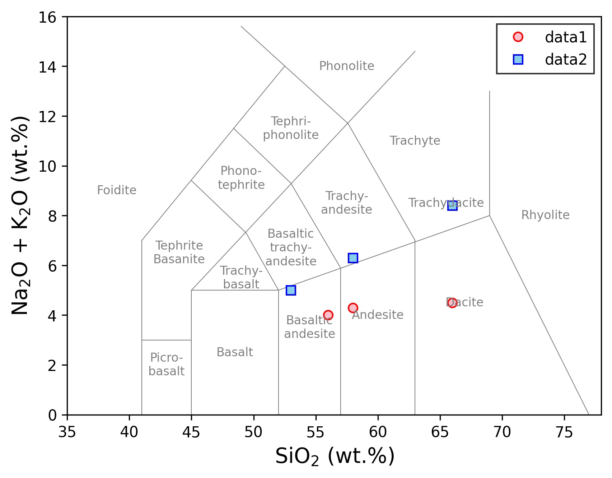

# plot-whole-rock-diagram
全岩化学組成のプロットを支援するスクリプトです．

## Requirement
以下の環境で開発・動作を確認しています．
- Python 3.8.5
- Maptlotlib 3.3.3

## Usage
`plotline.py`を適当なディレクトリに配置してインポートして使用する．
下のコード例では，簡単のためにプロット用の`main.py`と同じディレクトリに置いて実行している．

```Python
import matplotlib.pyplot as plt
import plotline

def main():
    data1 = [ [56, 58, 66], [4, 4.3, 4.5] ]
    data2 = [ [53, 58, 66], [5, 6.3, 8.4] ]
    fig = plt.figure()
    ax = fig.add_subplot(111)
    plotline.tas_diagram(ax)
    ax.plot(*data1, "o", mec="r", c="pink", label="data1")
    ax.plot(*data2, "s", mec="b", c="skyblue", label="data2")
    ax.set_xlim(35, 78)
    ax.set_ylim(0, 16)
    ax.set_xlabel("SiO$_2$ (wt.%)", fontsize=14)
    ax.set_ylabel("Na$_2$O + K$_2$O (wt.%)", fontsize=14)
    ax.legend(fancybox=False, edgecolor="k")
    fig.savefig('sampleimage.jpg', dpi=300, bbox_inches='tight')

if __name__ == "__main__":
    main()
```

Total alkali-silica (TAS) diagramのプロットができます．



## Reference
- Total alkali-silica (TAS) diagram: Le Bas et al. (1986) J. Petrol., 27: 745-750.

## Author
* Motohiro Sato (佐藤初洋)
* E-mail: msatores "at" gmail.com

## License
Copyright (C) 2021 Motohiro Sato

plot-whole-rock-diagram is released under [MIT license](https://opensource.org/licenses/mit-license.php).
